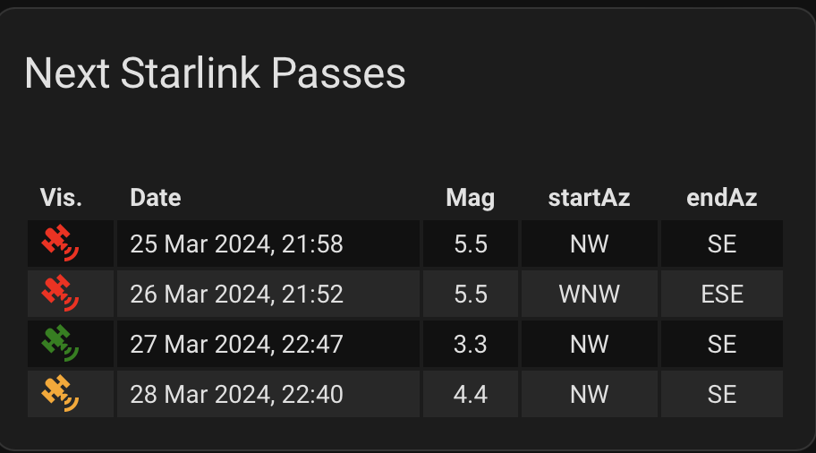

# findStarlink
Python code aiming to identify the Starlink satellite trains with the highest luminosity during the time between Astronomical twilight and sunrise.

As an amateur stargazer, I found myself captivated by the celestial ballet that unfolds above us each night. The stars, planets, and occasional meteor showers have always held a mysterious allure. However, it was the Starlink satellite trains that truly ignited my curiosity.
One evening, while scanning the night sky, I witnessed a procession of bright dots moving in a straight line across the heavens. These were the Starlink satellites, part of SpaceX’s ambitious project to provide global internet coverage. Their synchronized movement left me both awestruck and puzzled. How could I track these fleeting luminous streaks more effectively?
That’s when I decided to write a Python script. Armed with my newfound enthusiasm and a dash of coding knowledge, I embarked on a mission to create a tool that would predict the appearance of Starlink trains in my local sky. My code would fetch real-time satellite data, calculate their positions, and notify me when a train was about to pass overhead. It was my way of bridging the gap between the ancient wonder of the cosmos and the modern marvels of technology.
Late nights turned into early mornings as I tinkered with orbital mechanics, API requests, and plotting libraries. I learned about TLE (Two-Line Element) sets, azimuth, elevation, and the intricacies of Earth’s rotation. My little Python script evolved, and soon I could anticipate Starlink flyovers with precision. Armed with binoculars and a sense of anticipation, I’d step out into the crisp night air, waiting for those luminous dots to traverse the sky.
In the end, my amateur stargazing hobby had transformed into a delightful dance with artificial constellations. Writing that Python code wasn’t just about tracking satellites; it was about connecting with the cosmos in a whole new way. And as I stood there, watching those Starlink trains glide silently overhead, I felt a sense of wonder—a bridge between the ancient and the futuristic, all thanks to lines of code and a shared fascination with the universe

The Python code aims to identify the Starlink satellite trains with the lowest apparent magnitude during the time between Astronomical twilight and sunrise. The input for this code is a Two-Line Element (TLE) file, which contains orbital data for the Starlink satellites. The output is a JSON file that provides details about the upcoming passes of the selected satellites for the next 4 days.
By parsing this JSON file, you can create sensors in Home Assistant to monitor and track the Starlink trains. These sensors can display information such as pass times, elevation angles, and other relevant data. Here’s an example of how the sensor card might look:

```
command_line:
   - sensor:
      name: "starlink_1"
      icon: mdi:satellite-variant
      command: "cat path_to_the_JSON_file"
      json_attributes:
            - satellite
            - risingTime
            - culminationTime
            - settingTime
            - startAz
            - endAz
            - mag
            - date
      value_template: >
            {{ value_json.risingTime }} 
```



#Acknowledgements
Brandon Rhodes for the outstanding Skyfield library - https://rhodesmill.org/skyfield/
Anthony Mllama - Center for the Protection of Dark and Quiet Skied from Statelite Constellation Interference for the study on luminosity of the Starlink Satellites - https://export.arxiv.org/pdf/2401.01546 
